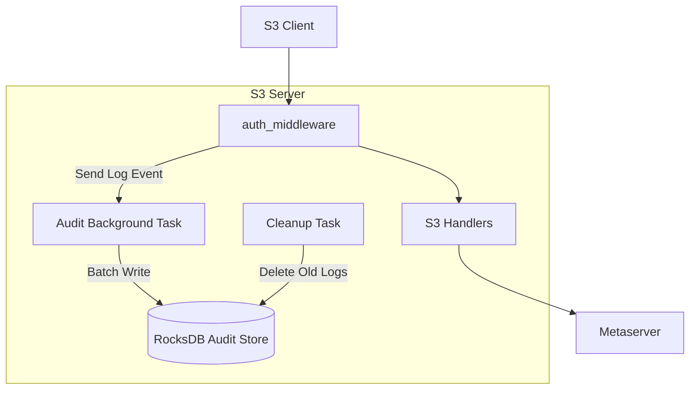

# Audit Logging (Security Event Trail) — 設計概要

> **対象タスク**: TODO.md §1 Security & Identity — Audit Logging (Security Event Trail)
> **前提**: OIDC & STS Integration および IAM ポリシー評価エンジンが実装済みであること
> **作成日**: 2026-03-13

## 1. 概要と目標

### 1.1 背景
セキュリティコンプライアンスにおいて、「誰が・いつ・何に対して・どのような操作を行い・結果がどうなったか」を追跡可能にすることは不可欠である。
現在の S3 サーバーは `tracing` による標準出力へのログのみを持っており、永続的な監査トレイルや後日の調査には不十分である。

### 1.2 ゴール
1. **構造化監査ログ**: 全てのアクションを一貫した JSON 形式で記録する。
2. **監査ログの永続化**: RocksDB を使用して、サーバー再起動後もログを保持する。
3. **パフォーマンスの維持**: ログ記録がリクエスト処理のボトルネックにならないよう、非同期で書き込む。
4. **自動メンテナンス**: 設定された保持期間（TTL）を過ぎた古いログを自動的に削除する。

---

## 2. システム構成

### 2.1 構成図

### 2.2 構成要素
1.  **`AuditRecord`**: ログ1件を表す構造体。
2.  **`AuditLogger`**: RocksDB の管理、書き込み用チャネルの提供、バックグラウンドワーカーの実行を担当。
3.  **`auth_middleware` 統合**: リクエスト開始時と完了時に情報を収集し、`AuditLogger` へ送信。

---

## 3. データ設計

### 3.1 ログフォーマット (AuditRecord)

| フィールド名 | 型 | 説明 |
| :--- | :--- | :--- |
| `timestamp` | ISO8601 | イベント発生時刻 (UTC) |
| `request_id` | String | リクエストの一意識別子 |
| `remote_ip` | String | クライアントの IP アドレス |
| `user_id` | String | Access Key ID または OIDC Sub |
| `role_arn` | String (Option) | 使用された IAM ロール |
| `action` | String | S3 アクション名 (例: `s3:PutObject`) |
| `resource` | String | リクエスト先リソース (ARN 形式) |
| `status_code` | u16 | HTTP ステータスコード |
| `error_code` | String (Option) | エラー時の S3 Error Code (例: `AccessDenied`) |
| `user_agent` | String (Option) | クライアントの User-Agent |

### 3.2 RocksDB キー設計
ログを時系列で効率的にスキャン・削除するため、キーにはタイムスタンプを含める。

**Key**: `audit:<timestamp_ms>:<uuid>`
- `timestamp_ms`: ビッグエンディアンの 8 バイト整数（時系列順に並めるため）。
- `uuid`: 同じミリ秒内の衝突回避。

**Value**: `AuditRecord` の JSON または Bincode シリアライズデータ。

---

## 4. 実装詳細

### 4.1 非同期書き込み
1. `AuditLogger` は起動時に `mpsc::channel` を作成する。
2. `auth_middleware` はチャネルを通じて `AuditRecord` を送信する（非ブロッキング）。
3. バックグラウンドタスクがチャネルから受信し、一定数または一定時間ごとに RocksDB へバッチ書き込み (`WriteBatch`) を行う。

### 4.2 TTL (自動削除)
1. 定期的（例: 1時間に1回）にクリーンアップタスクを起動。
2. 現在時刻 - 保持期間を計算。
3. RocksDB の `delete_range` を使用して、その時刻より前のキーを一括削除する。
   - `audit:0000000000000000` から `audit:<cutoff_timestamp>` まで。

---

## 5. 開発フェーズ

### Step 1: `common` へのデータ構造追加
- `dfs-common/src/auth/audit.rs` の作成。
- `AuditRecord` 構造体の定義。

### Step 2: `s3-server` への `AuditLogger` 実装
- RocksDB を初期化し、バックグラウンドループを持つ `AuditLogger` 構造体の作成。
- `AppState` への組み込み。

### Step 3: ミドルウェアの拡張
- `auth_middleware.rs` でリクエスト情報を抽出し、`AuditLogger` を呼び出す。
- 成功時だけでなく、 `s3_error_response` を返却するエラー時もログを記録するように修正。

### Step 4: メンテナンス機能とテスト
- クリーンアップロジックの実装。
- 統合テスト (`test_scripts/audit_log_test.sh`) による検証。

---

## 6. 設定 (環境変数)

- `AUDIT_LOG_ENABLED`: `true/false` (デフォルト: `true`)
- `AUDIT_LOG_DIR`: RocksDB の保存先ディレクトリ
- `AUDIT_LOG_RETENTION_DAYS`: ログ保持日数 (デフォルト: `30`)
- `AUDIT_LOG_BATCH_SIZE`: バッチ書き込みのサイズ (デフォルト: `100`)
